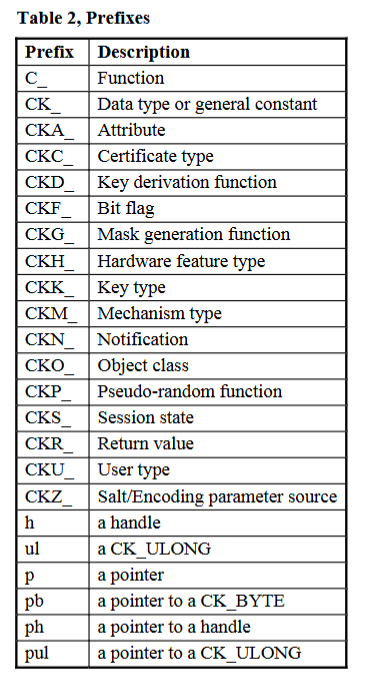
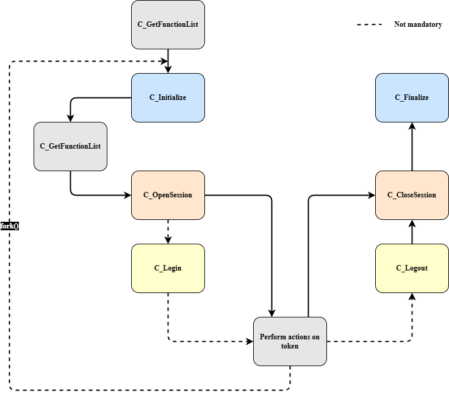

# Using Cryptoki with a Programming Language

Applications that access Cryptoki can be developed using a programming language (Java, Python, C/C++, …) or through a client tool provided by a token vendor (e.g., HSM, secure element, smart card).

When using a programming language, it is extremely useful to understand how Cryptoki is organized.

The first thing to know is **prefixes**. They are summarized in the table below. The most common are:

* **C\_** : Function (e.g., `C_Decrypt`)
* **CK\_** : Data type or general constant (e.g., `CK_BOOL`)
* **CKA\_** : Attribute (e.g., `PKCS11Constants.CKA_TOKEN`)
* **CKM\_** : Mechanism type (e.g., `CKM_AES_KEY_WRAP`)
* **CKF\_** : Flag, often used in conjunction with `CKM_`or `CK_ATTRIBUTE[]`

---

## Cryptoki Session Flow

The second thing to understand is how an application process interacts with Cryptoki. This knowledge helps determine when specific functions should be used.

A typical Cryptoki session follows these steps:

1. `C_GetFunctionList` — Retrieve function pointers.
2. `C_Initialize` — Initialize the Cryptoki library.
3. `C_GetFunctionList` — Obtain entry points of Cryptoki library functions.
4. `C_OpenSession` — Open a session with a token.
5. `C_Login` (if necessary) — Authenticate the user if required.
6. Perform operations on the token.
7. `C_Logout` (if necessary) — Log out from the token.
8. `C_CloseSession` — Close the session.
9. `C_Finalize` — Clean up Cryptoki resources.

---

## Applications and Processes

On most platforms, a Cryptoki application runs as a single process. In this case, the `C_Initialize` argument should be set to `NULL`.

In UNIX environments, a process (P) using Cryptoki can create a child process (C) using `fork()`. Since P and C have separate address spaces (or will upon a write operation if using copy-on-write), they are considered separate applications. Therefore, the Cryptoki interface must be initialized with specific arguments to manage process creation, destruction, and mutex handling.

If C needs to use Cryptoki, it must:

* Perform its own `C_Initialize` call.
* Log into tokens independently from P, if required.

If C attempts to use Cryptoki without its own `C_Initialize` call, the behavior is undefined. Ideally, it would return `CKR_CRYPTOKI_NOT_INITIALIZED`, but for performance reasons, this is not always enforced.

### Best Practices

* If C is created from a Cryptoki application, it should call `C_Initialize` immediately.
* If C does not need Cryptoki, it should call `C_Finalize` right after initialization.
* Following these practices prevents dangling duplicate resources created during the `fork()` call.

  

  

<b> Session Flow </b>
  

---

**© RSA Security Inc. — Public-Key Cryptography Standards (PKCS#11) v2.20**